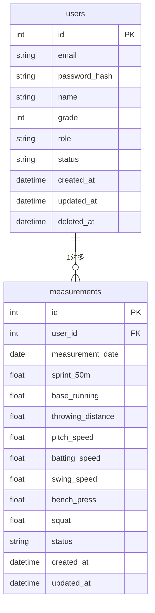
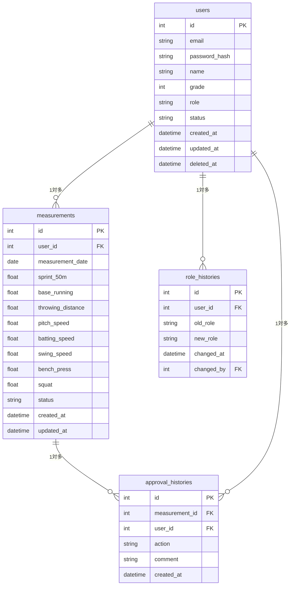

# ER図・テーブル設計（er.md）

---

## 1. ER図

### 課題1

### 課題2

---

## 2. テーブル定義

### 課題1

---

#### usersテーブル

| カラム名 | 型 | 制約 | 説明 |
|---|---|---|---|
| id | int | PK, AUTO INCREMENT | ユーザーID |
| email | varchar(255) | NOT NULL, UNIQUE | メールアドレス |
| password_hash | varchar(255) | NOT NULL | Argon2ハッシュ |
| name | varchar(100) | NOT NULL | 氏名 |
| grade | int | NULL | 学年（coach・director・managerはNULL） |
| role | varchar(20) | NOT NULL | member / manager / coach / director |
| status | varchar(20) | NOT NULL, DEFAULT 'active' | active / retired / withdrawn |
| created_at | datetime | NOT NULL | 作成日時 |
| updated_at | datetime | NOT NULL | 更新日時 |
| deleted_at | datetime | NULL | ソフトデリート日時 |

---

#### measurementsテーブル

| カラム名 | 型 | 制約 | 説明 |
|---|---|---|---|
| id | int | PK, AUTO INCREMENT | 測定記録ID |
| user_id | int | FK, NOT NULL | ユーザーID（users.id） |
| measurement_date | date | NOT NULL | 測定日 |
| sprint_50m | float | NOT NULL | 50m走（sec） |
| base_running | float | NOT NULL | ベースランニング（sec） |
| throwing_distance | float | NOT NULL | 遠投（m） |
| pitch_speed | float | NOT NULL | ストレート球速（km/h） |
| batting_speed | float | NOT NULL | 打球速度（km/h） |
| swing_speed | float | NOT NULL | スイング速度（km/h） |
| bench_press | float | NOT NULL | ベンチプレス（kg） |
| squat | float | NOT NULL | スクワット（kg） |
| status | varchar(20) | NOT NULL, DEFAULT 'draft' | draft / pending_member / pending_coach / approved / rejected |
| created_at | datetime | NOT NULL | 作成日時 |
| updated_at | datetime | NOT NULL | 更新日時 |

---

### 課題2

---

#### approval_historiesテーブル

| カラム名 | 型 | 制約 | 説明 |
|---|---|---|---|
| id | int | PK, AUTO INCREMENT | 承認履歴ID |
| measurement_id | int | FK, NOT NULL | 測定記録ID（measurements.id） |
| user_id | int | FK, NOT NULL | 承認者ID（users.id） |
| action | varchar(20) | NOT NULL | approve / reject |
| comment | text | NULL | 承認コメント（課題2） |
| created_at | datetime | NOT NULL | 承認日時 |

---

#### role_historiesテーブル

| カラム名 | 型 | 制約 | 説明 |
|---|---|---|---|
| id | int | PK, AUTO INCREMENT | ロール履歴ID |
| user_id | int | FK, NOT NULL | 対象ユーザーID（users.id） |
| old_role | varchar(20) | NOT NULL | 変更前ロール |
| new_role | varchar(20) | NOT NULL | 変更後ロール |
| changed_at | datetime | NOT NULL | 変更日時 |
| changed_by | int | FK, NOT NULL | 変更者ID（users.id） |

---

## 3. ステータス定義

### usersテーブル status

| 値 | 説明 |
|---|---|
| active | 在籍中 |
| retired | 引退 |
| withdrawn | 退部 |

### measurementsテーブル status

| 値 | 説明 |
|---|---|
| draft | 入力中 |
| pending_member | 部員確認待ち |
| pending_coach | コーチ確認待ち |
| approved | 承認済み |
| rejected | 否認 |

---

## 4. 設計方針

| 項目 | 内容 |
|---|---|
| ソフトデリート | usersテーブルはdeleted_atとstatusで管理 |
| 課題1→課題2の拡張 | measurementsのstatusカラムを残しつつapproval_historiesを追加 |
| ロール管理 | 課題1はroleカラムのみ、課題2でrole_historiesを追加 |
| NULL許容 | gradeはcoach・director・managerの場合はNULL |