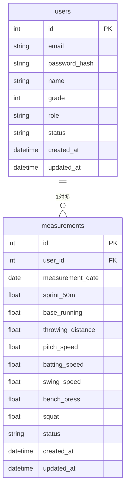
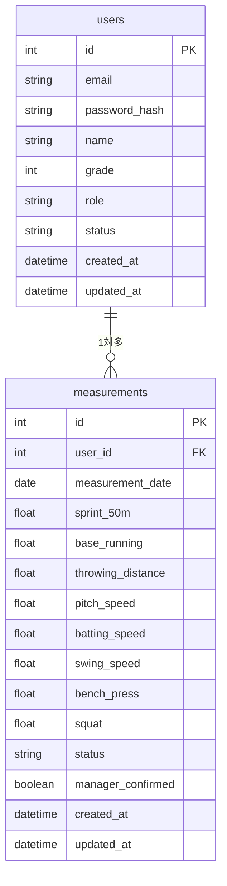

# ER図・テーブル設計（er.md）

---

## 1. ER図

### 課題1

### 課題2

---

## 2. テーブル定義

### 課題1

---

#### usersテーブル

| カラム名 | 型 | 制約 | 説明 |
|---|---|---|---|
| id | int | PK, AUTO INCREMENT | ユーザーID |
| email | varchar(255) | NOT NULL, UNIQUE | メールアドレス |
| password_hash | varchar(255) | NOT NULL | Argon2ハッシュ |
| name | varchar(100) | NOT NULL | 氏名 |
| grade | int | NULL | 学年（coach・director・managerはNULL） |
| role | varchar(20) | NOT NULL | member / manager / coach / director |
| status | varchar(20) | NOT NULL, DEFAULT 'active' | active / retired / withdrawn |
| created_at | datetime | NOT NULL | 作成日時 |
| updated_at | datetime | NOT NULL | 更新日時 |

---

#### measurementsテーブル

| カラム名 | 型 | 制約 | 説明 |
|---|---|---|---|
| id | int | PK, AUTO INCREMENT | 測定記録ID |
| user_id | int | FK, NOT NULL | ユーザーID（users.id） |
| measurement_date | date | NOT NULL | 測定日 |
| sprint_50m | float | NOT NULL | 50m走（sec） |
| base_running | float | NOT NULL | ベースランニング（sec） |
| throwing_distance | float | NOT NULL | 遠投（m） |
| pitch_speed | float | NOT NULL | ストレート球速（km/h） |
| batting_speed | float | NOT NULL | 打球速度（km/h） |
| swing_speed | float | NOT NULL | スイング速度（km/h） |
| bench_press | float | NOT NULL | ベンチプレス（kg） |
| squat | float | NOT NULL | スクワット（kg） |
| status | varchar(20) | NOT NULL, DEFAULT 'draft' | draft / pending_member / pending_coach / approved / rejected |
| created_at | datetime | NOT NULL | 作成日時 |
| updated_at | datetime | NOT NULL | 更新日時 |

---

### 課題2

---

#### measurementsテーブル（追加カラム）

| カラム名 | 型 | 制約 | 説明 |
|---|---|---|---|
| manager_confirmed | tinyint(1) | NOT NULL, DEFAULT 0 | マネージャー確認済みフラグ（0: 未確認 / 1: 確認済み） |

---

## 3. インデックス設計

### usersテーブル

| インデックス名 | カラム | 用途 |
|---|---|---|
| ix_users_role | role | ロール別部員一覧取得の高速化 |
| ix_users_status | status | 在籍状況での絞り込みの高速化 |

### measurementsテーブル

| インデックス名 | カラム | 用途 |
|---|---|---|
| ix_measurements_user_id | user_id | 部員別測定記録取得の高速化 |
| ix_measurements_status | status | 承認フローの絞り込みの高速化 |
| ix_measurements_measurement_date | measurement_date | 計測日での絞り込みの高速化 |
| ix_measurements_user_id_measurement_date | user_id, measurement_date | 重複チェック用複合インデックス |

---

## 4. ステータス定義

### usersテーブル status

| 値 | 説明 |
|---|---|
| active | 在籍中 |
| retired | 引退 |
| withdrawn | 退部 |

### measurementsテーブル status

| 値 | 説明 |
|---|---|
| draft | 入力中 |
| pending_member | 部員確認待ち |
| pending_coach | コーチ確認待ち |
| approved | 承認済み |
| rejected | 否認 |

---

## 5. 設計方針

| 項目 | 内容 |
|---|---|
| ソフトデリート | usersテーブルはstatusで管理（deleted_atは未実装） |
| タイムスタンプ管理 | created_at / updated_at はPython側（datetime.now(timezone.utc)）で明示的に管理 |
| manager_confirmed | localStorageではなくDBに永続化（複数デバイス・複数マネージャー対応） |
| NULL許容 | gradeはcoach・director・managerの場合はNULL |
| 将来の拡張（未実装） | approval_histories（承認履歴）・role_histories（ロール変更履歴）は提案として検討中 |