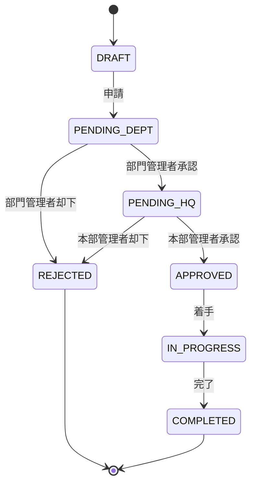

# ステータス設計

## projects.status

| ステータス   | 説明                 | 遷移元                    | 遷移先                |
| ------------ | -------------------- | ------------------------- | --------------------- |
| DRAFT        | 下書き（未申請）     | -                         | PENDING_DEPT          |
| PENDING_DEPT | 部門管理者承認待ち   | DRAFT                     | PENDING_HQ / REJECTED |
| PENDING_HQ   | 本部管理者承認待ち   | PENDING_DEPT              | APPROVED / REJECTED   |
| APPROVED     | 承認済み（着手待ち） | PENDING_HQ                | IN_PROGRESS           |
| IN_PROGRESS  | 進行中               | APPROVED                  | COMPLETED             |
| COMPLETED    | 完了                 | IN_PROGRESS               | -                     |
| REJECTED     | 却下                 | PENDING_DEPT / PENDING_HQ | -                     |

### ステータス遷移図

### 操作権限

| 操作     | 対象ステータス            | 実行可能ロール                                     |
| -------- | ------------------------- | -------------------------------------------------- |
| 申請     | DRAFT → PENDING_DEPT      | APPLICANT                                          |
| 一次承認 | PENDING_DEPT → PENDING_HQ | DEPT_MANAGER                                       |
| 一次却下 | PENDING_DEPT → REJECTED   | DEPT_MANAGER                                       |
| 最終承認 | PENDING_HQ → APPROVED     | HQ_MANAGER                                         |
| 最終却下 | PENDING_HQ → REJECTED     | HQ_MANAGER                                         |
| 着手     | APPROVED → IN_PROGRESS    | APPLICANT（自案件のみ）/ DEPT_MANAGER / HQ_MANAGER |
| 完了     | IN_PROGRESS → COMPLETED   | DEPT_MANAGER / HQ_MANAGER                          |

---

## tasks.status

| ステータス  | 説明       | 遷移元                  | 遷移先             |
| ----------- | ---------- | ----------------------- | ------------------ |
| TODO        | 未着手     | -                       | IN_PROGRESS        |
| IN_PROGRESS | 進行中     | TODO                    | IN_REVIEW / DONE   |
| IN_REVIEW   | レビュー中 | IN_PROGRESS             | IN_PROGRESS / DONE |
| DONE        | 完了       | IN_REVIEW / IN_PROGRESS | -                  |

### 進捗率との連動

| 条件                       | 自動変更内容                          |
| -------------------------- | ------------------------------------- |
| ステータスをDONEに変更     | 進捗率が自動的に100%になる            |
| 進捗率を100%に変更         | ステータスが自動的にDONEになる        |
| DONE状態から進捗率を下げる | ステータスが自動的にIN_PROGRESSになる |
