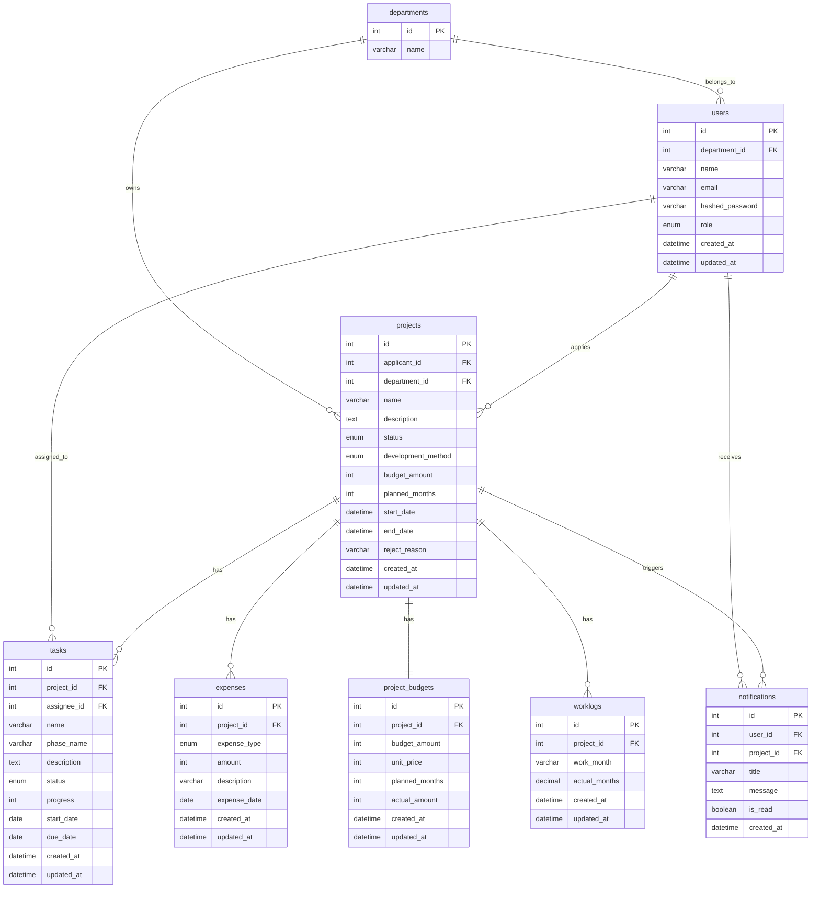

# ER設計

## ■ 概要

本システムは、  
ウォーターフォール型開発案件における  
進捗・予算の予実可視化を目的とした  
開発管理PoCである。

プロジェクトを中心に、  
タスク・工数・予算・実績を管理する構造とした。

ユーザーは部門に所属し、  
ロールに応じて案件申請、承認、タスク管理、  
工数記録、予算確認を行う。

本PoCでは、  
実務運用を意識し、

- 案件申請
- 承認フロー
- KPI監視
- 進捗管理
- 予算消費状況管理

を主目的としている。

---

## ■ ER図

---

## ■ 補足設計

### development_method カラムについて

本PoCでは、  
ウォーターフォール型案件管理へスコープを限定しているため、  
現行UIでは開発手法選択機能は提供していない。

一方で、  
将来的なアジャイル案件対応や  
ハイブリッド型運用への拡張性を考慮し、  
DB設計上は `development_method` カラムを保持している。

---

### phase_name カラムについて

`tasks.phase_name` は、  
ウォーターフォール型開発における工程分類を想定している。

例：

- 要件定義
- 基本設計
- 詳細設計
- 実装
- テスト
- リリース

ガントチャートや工程別進捗管理で利用する。

---

## ■ Enum定義

### UserRole

| 値           | 説明       |
| ------------ | ---------- |
| APPLICANT    | 申請者     |
| TASK_MEMBER  | 担当者     |
| DEPT_MANAGER | 部門管理者 |
| HQ_MANAGER   | 本部管理者 |

---

### ProjectStatus

| 値           | 説明         |
| ------------ | ------------ |
| DRAFT        | 下書き       |
| PENDING_DEPT | 部門承認待ち |
| PENDING_HQ   | 本部承認待ち |
| APPROVED     | 承認済み     |
| IN_PROGRESS  | 進行中       |
| COMPLETED    | 完了         |
| REJECTED     | 却下         |

---

### DevelopmentMethod

| 値        | 説明               |
| --------- | ------------------ |
| WATERFALL | ウォーターフォール |
| AGILE     | 将来拡張用         |

---

### TaskStatus

| 値          | 説明       |
| ----------- | ---------- |
| TODO        | 未着手     |
| IN_PROGRESS | 進行中     |
| IN_REVIEW   | レビュー中 |
| DONE        | 完了       |

---

### ExpenseType

| 値          | 説明         |
| ----------- | ------------ |
| OUTSOURCING | 外注費       |
| LICENSE     | ライセンス費 |
| EQUIPMENT   | 機材費       |
| OTHER       | その他       |
