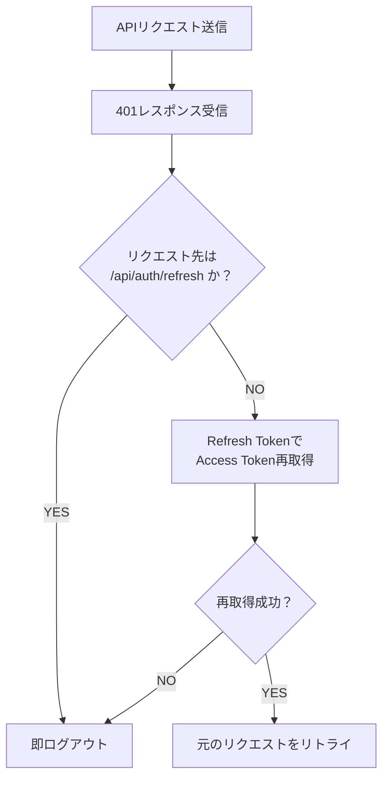

# セッション管理

## リロード時の認証状態復元

1. `tokenExpiry`（有効期限）を`sessionStorage`に保存
2. ページロード時に確認
3. 期限内なら `/api/auth/refresh` でAccess Token再取得
4. 期限切れ・取得失敗 → ログイン画面へ

## 自動ログアウト

- 無操作30分でAccess Token破棄・ログイン画面へ
- `setInterval`でタイマー管理（操作時にリセット）

## 401エラー処理（axiosインターセプター）

## ログアウト処理

1. `POST /api/auth/logout` → Refresh Token削除・Cookie無効化
2. PiniaストアからAccess Token・ユーザー情報削除
3. `sessionStorage` から `tokenExpiry` 削除
4. ログイン画面へリダイレクト